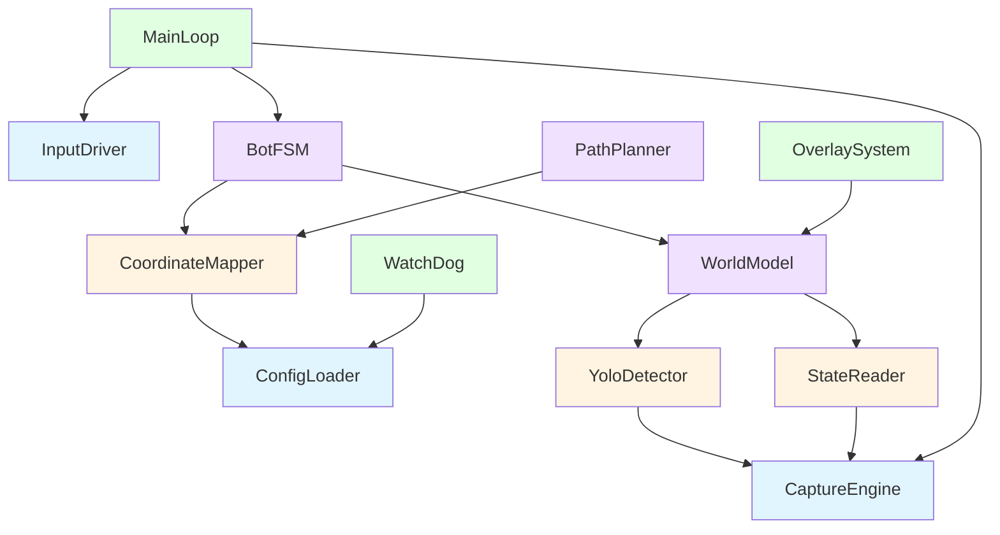
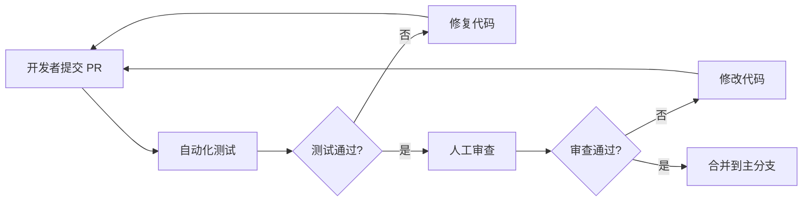

# AradVision 分模块开发指南 (Modular Development Guide)

**项目名称**: AradVision - DNF 视觉辅助自动化系统
**文档标识**: ARAD-Guide-006
**版本**: V1.0
**状态**: 正式版
**最后更新日期**: 2026-02-10

---

## 目录 (Table of Contents)

1. [概述](#1-概述introduction)
2. [模块依赖关系图 (DAG)](#2-模块依赖关系图dependency-dag)
3. [模块接口契约](#3-模块接口契约interface-contracts)
4. [模块 Mock 设计](#4-模块-mock-设计mock-design)
5. [开发顺序建议](#5-开发顺序建议development-sequence)
6. [集成策略](#6-集成策略integration-strategy)
7. [协作规范](#7-协作规范collaboration-best-practices)
8. [测试与验证](#8-测试与验证testing-and-validation)

---

## 1. 概述 (Introduction)

### 1.1 文档目的

本文档旨在为多名开发者并行开发 AradVision 项目提供指导，通过明确的模块划分、接口定义和 Mock 设计，实现：

- **独立开发**: 不同开发者可同时开发不同模块，互不干扰
- **并行推进**: 核心模块可并行开发，通过 Mock 进行单元测试
- **平滑集成**: 定义清晰的接口契约，降低集成成本

### 1.2 架构分层

系统采用四层架构，自底向上依次为：

```
┌─────────────────────────────────────────┐
│     应用层 (Application Layer)          │  ← main.py, 主循环
├─────────────────────────────────────────┤
│     决策层 (Decision Layer)             │  ← BotFSM, PathPlanner
├─────────────────────────────────────────┤
│     感知层 (Perception Layer)           │  ← YoloDetector, StateReader
├─────────────────────────────────────────┤
│   基础设施层 (Infrastructure Layer)     │  ← CaptureEngine, InputDriver
└─────────────────────────────────────────┘
```

**数据流向**: 单向流动，上层依赖下层，下层不依赖上层。

---

## 2. 模块依赖关系图 (Dependency DAG)

### 2.1 模块依赖 DAG (有向无环图)



### 2.2 依赖关系矩阵

| 模块 | ConfigLoader | CaptureEngine | InputDriver | YoloDetector | StateReader | CoordinateMapper | WorldModel | BotFSM | PathPlanner | MainLoop |
|------|--------------|---------------|-------------|--------------|-------------|------------------|------------|--------|-------------|----------|
| **ConfigLoader** | - | ✓ | ✓ | ✓ | ✓ | ✓ | ✓ | ✓ | ✓ | ✓ |
| **CaptureEngine** | - | - | - | ✓ | ✓ | - | - | - | - | ✓ |
| **InputDriver** | ✓ | - | - | - | - | - | - | - | - | ✓ |
| **YoloDetector** | ✓ | ✓ | - | - | - | - | ✓ | - | - | - |
| **StateReader** | ✓ | ✓ | - | - | - | - | ✓ | - | - | - |
| **CoordinateMapper** | ✓ | - | - | - | - | - | - | ✓ | ✓ | - |
| **WorldModel** | ✓ | - | - | ✓ | ✓ | - | - | ✓ | - | - |
| **BotFSM** | ✓ | - | - | - | - | ✓ | ✓ | - | ✓ | ✓ |
| **PathPlanner** | ✓ | - | - | - | - | ✓ | - | - | - | - |
| **MainLoop** | ✓ | ✓ | ✓ | - | - | - | - | ✓ | - | - |

**图例**: ✓ 表示左侧模块依赖上方模块

### 2.3 关键依赖规则

1. **单向依赖**: 上层可调用下层，下层严禁调用上层
2. **水平隔离**: 感知层内部模块 (YoloDetector, StateReader) 互不依赖
3. **配置统一**: 所有模块均依赖 ConfigLoader，禁止硬编码配置

---

## 3. 模块接口契约 (Interface Contracts)

### 3.1 数据类型定义 (位于 `core/types.py`)

```python
from dataclasses import dataclass
from typing import Tuple, List, Optional
from enum import Enum
import numpy as np

# ==================== 基础数据类型 ====================

@dataclass
class BBox:
    """边界框 (Bounding Box)"""
    x1: int
    y1: int
    x2: int
    y2: int

    @property
    def width(self) -> int:
        return self.x2 - self.x1

    @property
    def height(self) -> int:
        return self.y2 - self.y1

    @property
    def center(self) -> Tuple[int, int]:
        return ((self.x1 + self.x2) // 2, (self.y1 + self.y2) // 2)

@dataclass
class GameObject:
    """游戏对象基类"""
    id: int                      # 唯一追踪ID
    cls_id: int                  # 类别ID: 0=Monster, 1=Hero, 2=Item, 3=Gate
    cls_name: str                # 类别名称
    conf: float                  # 置信度 [0.0, 1.0]
    bbox: BBox                   # 边界框

    @property
    def foot_point(self) -> Tuple[int, int]:
        """
        计算落地坐标 (2.5D 修正)
        逻辑: 取底部中心，向上修正 5% 避免判定点过低
        """
        cx = self.bbox.center[0]
        fy = int(self.bbox.y2 * 0.95 + self.bbox.y1 * 0.05)
        return (cx, fy)

# ==================== 上下文数据类型 ====================

@dataclass
class PlayerState:
    """玩家状态"""
    hp_percent: float            # 血量百分比 [0.0, 1.0]
    mp_percent: float            # 蓝量百分比 [0.0, 1.0]
    position: Tuple[int, int]    # 屏幕坐标 (x, y)
    available_skills: List[str]  # 可用技能列表 (技能键名)
    is_buffed: bool              # 是否有Buff

@dataclass
class GameContext:
    """游戏上下文 (每帧快照)"""
    frame_index: int             # 帧序号
    timestamp: float             # 时间戳
    image: np.ndarray            # 原始截图 (BGR格式)

    # 检测结果
    hero: Optional[GameObject]   # 玩家对象
    monsters: List[GameObject]   # 怪物列表
    items: List[GameObject]      # 物品列表
    doors: List[GameObject]      # 门列表

    # 状态读取结果
    player_state: PlayerState    # 玩家状态
    room_cleared: bool           # 房间是否清空

# ==================== 指令数据类型 ====================

class CommandType(Enum):
    """指令类型枚举"""
    MOVE = "MOVE"
    MOVE_RUN = "MOVE_RUN"
    ATTACK = "ATTACK"
    SKILL = "SKILL"
    PICKUP = "PICKUP"
    USE_POTION = "USE_POTION"
    WAIT = "WAIT"

@dataclass
class Command:
    """执行指令"""
    type: CommandType            # 指令类型
    direction: Optional[Tuple[int, int]] = None  # 方向向量 (dx, dy)
    key_code: Optional[str] = None               # 按键代码
    duration: float = 0.0         # 持续时间 (秒)
    target: Optional[Tuple[int, int]] = None     # 目标坐标
```

---

### 3.2 基础设施层接口

#### 3.2.1 ConfigLoader 模块

**文件**: `core/config.py`

```python
from typing import Dict, Any
import yaml

class ConfigLoader:
    """
    配置加载器 (单例模式)
    职责: 加载和管理 YAML 配置文件
    """

    _instance = None

    def __new__(cls):
        if cls._instance is None:
            cls._instance = super().__new__(cls)
        return cls._instance

    def __init__(self):
        self._config: Dict[str, Any] = {}
        self._load_config()

    def _load_config(self, config_path: str = "configs/default.yaml"):
        """
        加载配置文件

        Args:
            config_path: YAML 配置文件路径

        Raises:
            FileNotFoundError: 配置文件不存在
            yaml.YAMLError: YAML 格式错误
        """
        # 实现略
        pass

    def get(self, key: str, default: Any = None) -> Any:
        """
        获取配置项 (支持嵌套路径，如 'vision.conf_threshold')

        Args:
            key: 配置键名 (支持点号分隔的嵌套路径)
            default: 默认值

        Returns:
            配置值
        """
        # 实现略
        pass

    # 便捷访问方法
    @property
    def fps_limit(self) -> int:
        return self.get('system.fps_limit', 30)

    @property
    def model_path(self) -> str:
        return self.get('vision.model_path', './assets/weights/dnf_v1.pt')

    @property
    def window_title(self) -> str:
        return self.get('game.window_title', 'Dungeon & Fighter')
```

**接口契约**:
- **输入**: YAML 文件路径
- **输出**: 配置字典 (嵌套结构)
- **异常**: FileNotFoundError, YAMLError
- **线程安全**: 是 (单例模式)

---

#### 3.2.2 CaptureEngine 模块

**文件**: `core/capture.py`

```python
import numpy as np
import win32gui
import win32ui
from typing import Optional

class CaptureError(Exception):
    """截图异常"""
    pass

class CaptureEngine:
    """
    屏幕捕获引擎
    职责:
      1. 维护游戏窗口句柄
      2. 提供高性能截图功能
      3. 处理窗口最小化/遮挡异常
    """

    def __init__(self, window_title: str):
        """
        初始化截图引擎

        Args:
            window_title: 游戏窗口标题 (支持部分匹配)

        Raises:
            CaptureError: 找不到游戏窗口
        """
        self._hwnd = self._find_window(window_title)
        self._client_rect = self._get_client_rect()

    def grab(self) -> np.ndarray:
        """
        截取当前游戏画面

        Returns:
            BGR 格式的 numpy 数组 (height, width, 3)

        Raises:
            CaptureError: 窗口最小化或被遮挡
        """
        # 实现略 (使用 Win32 API 或 MSS)
        pass

    def _find_window(self, title: str) -> int:
        """查找窗口句柄"""
        # 实现略
        pass

    def _get_client_rect(self) -> Tuple[int, int, int, int]:
        """获取客户区尺寸 (去除标题栏)"""
        # 实现略
        pass
```

**接口契约**:
- **输入**: 无 (内部自动截图)
- **输出**: np.ndarray (BGR 格式图像)
- **性能**: 单次调用 < 10ms
- **异常**: CaptureError

---

#### 3.2.3 InputDriver 模块

**文件**: `core/input.py`

```python
from typing import Tuple
import time
import random

class InputDriver:
    """
    输入驱动器
    职责:
      1. 封装底层 DirectX 扫描码
      2. 提供拟人化输入模拟 (随机延迟)
      3. 支持按键按下/弹起/保持
    """

    # DirectX 扫描码映射表
    SCANCODE_MAPPING = {
        'UP': 0xC8,
        'DOWN': 0xD0,
        'LEFT': 0xCB,
        'RIGHT': 0xCD,
        'X': 0x2D,      # 攻击
        'A': 0x1E,      # 技能1
        'S': 0x1F,      # 技能2
        'SPACE': 0x39,  # Buff/跳跃
        '1': 0x02,      # 药水
        # ... 更多按键
    }

    def press(self, key: str, duration: float = 0.1):
        """
        按下按键 (按下 -> 等待 -> 弹起)

        Args:
            key: 按键名称 (如 'X', 'UP')
            duration: 持续时间 (秒)，会加入随机抖动
        """
        # 实现略
        pass

    def tap(self, key: str):
        """
        点击按键 (短按，默认 50ms)

        Args:
            key: 按键名称
        """
        self.press(key, duration=random.uniform(0.05, 0.08))

    def hold(self, key: str, duration: float):
        """
        长按按键

        Args:
            key: 按键名称
            duration: 持续时间 (秒)
        """
        # 实现略
        pass

    def move(self, direction: Tuple[int, int], duration: float = 0.1):
        """
        移动方向 (同时按住两个方向键)

        Args:
            direction: 方向向量 (dx, dy)，如 (1, 0) 向右
            duration: 持续时间
        """
        # 实现略
        pass

    def _send_scan_code(self, code: int, is_press: bool):
        """
        发送底层扫描码 (使用 SendInput Win32 API)

        Args:
            code: 扫描码
            is_press: True=按下, False=弹起
        """
        # 实现略
        pass
```

**接口契约**:
- **输入**: Command 对象
- **输出**: 无 (直接发送硬件信号)
- **性能**: 单次调用 < 5ms
- **反检测**: 必须加入随机延迟 (高斯分布)

---

### 3.3 感知层接口

#### 3.3.1 YoloDetector 模块

**文件**: `vision/detector.py`

```python
from typing import List
import numpy as np
from ultralytics import YOLO
from core.types import GameObject, BBox

class YoloDetector:
    """
    YOLO 目标检测器
    职责:
      1. 加载 YOLO 模型
      2. 执行推理
      3. 解析输出为 GameObject 列表
    """

    def __init__(self, model_path: str, conf_threshold: float = 0.6):
        """
        初始化检测器

        Args:
            model_path: 模型权重文件路径 (.pt)
            conf_threshold: 置信度阈值
        """
        self.model = YOLO(model_path)
        self.conf_threshold = conf_threshold

        # 类别名称映射 (需与训练时一致)
        self.class_names = ['monster', 'hero', 'item', 'gate']

    def detect(self, image: np.ndarray) -> List[GameObject]:
        """
        执行目标检测

        Args:
            image: BGR 格式图像 (numpy array)

        Returns:
            GameObject 列表

        Performance:
            GPU 加速: < 30ms (1080p)
            CPU 推理: < 100ms (1080p)
        """
        results = self.model(image, verbose=False, conf=self.conf_threshold)

        objects = []
        for idx, result in enumerate(results[0].boxes):
            # 解析边界框
            x1, y1, x2, y2 = result.xyxy[0].cpu().numpy()
            conf = float(result.conf[0])
            cls_id = int(result.cls[0])

            obj = GameObject(
                id=idx,
                cls_id=cls_id,
                cls_name=self.class_names[cls_id],
                conf=conf,
                bbox=BBox(int(x1), int(y1), int(x2), int(y2))
            )
            objects.append(obj)

        return objects
```

**接口契约**:
- **输入**: np.ndarray (BGR 图像)
- **输出**: List[GameObject]
- **性能**: < 30ms (GPU), < 100ms (CPU)
- **依赖**: ultralytics, torch

---

#### 3.3.2 StateReader 模块

**文件**: `vision/state_reader.py`

```python
import numpy as np
import cv2
from core.types import PlayerState

class StateReader:
    """
    游戏状态读取器
    职责:
      1. 通过颜色识别读取 HP/MP
      2. 检测技能冷却状态
      3. 识别小地图位置
    """

    # HP/MP 条的 ROI 区域 (相对于窗口的百分比)
    HP_BAR_ROI = (0.25, 0.90, 0.45, 0.92)  # (x1, y1, x2, y2)
    MP_BAR_ROI = (0.25, 0.92, 0.45, 0.94)

    # HP 颜色阈值 (HSV)
    HP_COLOR_LOWER = (0, 150, 150)   # 红色下限
    HP_COLOR_UPPER = (10, 255, 255) # 红色上限

    def __init__(self, window_size: Tuple[int, int]):
        """
        初始化状态读取器

        Args:
            window_size: 游戏窗口尺寸 (width, height)
        """
        self.window_width, self.window_height = window_size
        self._init_rois()

    def _init_rois(self):
        """初始化 ROI 绝对坐标"""
        self.hp_bar_roi = self._calc_absolute_roi(self.HP_BAR_ROI)
        self.mp_bar_roi = self._calc_absolute_roi(self.MP_BAR_ROI)
        # ... 其他 ROI

    def read_player_state(self, image: np.ndarray) -> PlayerState:
        """
        读取玩家状态

        Args:
            image: 全屏截图

        Returns:
            PlayerState 对象
        """
        hp_percent = self._read_hp_percent(image)
        mp_percent = self._read_mp_percent(image)
        position = self._read_minimap_position(image)
        available_skills = self._read_skill_cooldowns(image)

        return PlayerState(
            hp_percent=hp_percent,
            mp_percent=mp_percent,
            position=position,
            available_skills=available_skills,
            is_buffed=False  # 暂未实现
        )

    def _read_hp_percent(self, image: np.ndarray) -> float:
        """读取血量百分比"""
        # 实现略 (颜色识别)
        pass

    def _read_minimap_position(self, image: np.ndarray) -> Tuple[int, int]:
        """读取小地图位置"""
        # 实现略 (模板匹配)
        pass

    def _read_skill_cooldowns(self, image: np.ndarray) -> List[str]:
        """读取可用技能列表"""
        # 实现略 (灰度检测)
        pass
```

**接口契约**:
- **输入**: np.ndarray (全屏截图)
- **输出**: PlayerState
- **性能**: < 20ms
- **依赖**: cv2, numpy

---

### 3.4 决策层接口

#### 3.4.1 BotFSM 模块

**文件**: `logic/bot_fsm.py`

```python
from enum import Enum
from typing import Optional
from core.types import GameContext, Command, CommandType

class BotState(Enum):
    """机器人状态枚举"""
    IDLE = 0        # 待机/加载中
    COMBAT = 1      # 战斗中
    LOOT = 2        # 拾取物品
    NAVIGATE = 3    # 寻找下一房间
    RECOVERY = 4    # 异常恢复

class BotFSM:
    """
    机器人有限状态机
    职责:
      1. 维护当前状态
      2. 根据游戏上下文进行状态转换
      3. 生成执行指令
    """

    def __init__(self):
        self.current_state = BotState.IDLE
        self.state_history = []  # 状态历史记录

    def update(self, ctx: GameContext) -> Command:
        """
        状态机更新 (每帧调用)

        Args:
            ctx: 游戏上下文

        Returns:
            Command 对象
        """
        # 1. 检查生存 (优先级最高)
        if ctx.player_state.hp_percent < 0.3:
            return Command(type=CommandType.USE_POTION, key_code='1')

        # 2. 状态转换
        self._transition_state(ctx)

        # 3. 根据当前状态执行逻辑
        if self.current_state == BotState.COMBAT:
            return self._combat_logic(ctx)
        elif self.current_state == BotState.LOOT:
            return self._loot_logic(ctx)
        elif self.current_state == BotState.NAVIGATE:
            return self._navigate_logic(ctx)
        else:
            return Command(type=CommandType.WAIT, duration=0.1)

    def _transition_state(self, ctx: GameContext):
        """状态转换逻辑"""
        if len(ctx.monsters) > 0:
            self.current_state = BotState.COMBAT
        elif len(ctx.items) > 0:
            self.current_state = BotState.LOOT
        elif ctx.room_cleared:
            self.current_state = BotState.NAVIGATE
        else:
            self.current_state = BotState.IDLE

    def _combat_logic(self, ctx: GameContext) -> Command:
        """战斗逻辑 (索敌、对齐、攻击)"""
        # 实现略 (见详细设计文档)
        pass

    def _loot_logic(self, ctx: GameContext) -> Command:
        """拾取逻辑"""
        # 实现略
        pass

    def _navigate_logic(self, ctx: GameContext) -> Command:
        """导航逻辑"""
        # 实现略
        pass
```

**接口契约**:
- **输入**: GameContext
- **输出**: Command
- **性能**: < 5ms
- **逻辑**: 有限状态机 (FSM)

---

#### 3.4.2 PathPlanner 模块

**文件**: `logic/path_planner.py`

```python
from typing import Tuple, List
from core.types import GameObject

class PathPlanner:
    """
    路径规划器
    职责:
      1. 计算 Y 轴对齐移动指令
      2. 计算避障路径
      3. 预测目标位置
    """

    Y_ALIGN_TOLERANCE = 15  # Y 轴对齐容差 (像素)
    ATTACK_RANGE_X = 120    # X 轴攻击距离 (像素)

    def plan_move_to_target(
        self,
        hero: GameObject,
        target: GameObject
    ) -> Tuple[int, int, float]:
        """
        规划移动到目标的指令

        Args:
            hero: 玩家对象
            target: 目标对象

        Returns:
            (dx, dy, duration) 方向向量和持续时间
        """
        dx = target.foot_point[0] - hero.foot_point[0]
        dy = target.foot_point[1] - hero.foot_point[1]

        # 1. 优先 Y 轴对齐
        if abs(dy) > self.Y_ALIGN_TOLERANCE:
            return (0, 1 if dy > 0 else -1, 0.1)

        # 2. Y 轴对齐后，X 轴逼近
        if abs(dx) > self.ATTACK_RANGE_X:
            return (1 if dx > 0 else -1, 0, 0.1)

        # 3. 距离合适，无需移动
        return (0, 0, 0)

    def plan_avoid_obstacle(
        self,
        hero: GameObject,
        obstacles: List[GameObject]
    ) -> Tuple[int, int]:
        """
        规划避障路径

        Args:
            hero: 玩家对象
            obstacles: 障碍物列表

        Returns:
            (dx, dy) 避障方向
        """
        # 实现略 (势场法或简单规则)
        pass
```

**接口契约**:
- **输入**: GameObject (玩家 + 目标)
- **输出**: Tuple[int, int, float] (方向向量 + 持续时间)
- **性能**: < 1ms

---

## 4. 模块 Mock 设计 (Mock Design)

### 4.1 Mock 设计原则

1. **接口一致性**: Mock 类实现与真实类相同的接口
2. **数据可控性**: 支持注入测试数据
3. **行为可预测**: 输出确定，便于单元测试
4. **性能优先**: Mock 不消耗 GPU 资源

### 4.2 基础设施层 Mock

#### 4.2.1 MockCaptureEngine

**文件**: `tests/mocks/capture_mock.py`

```python
import numpy as np
import os
from typing import List
from core.capture import CaptureEngine, CaptureError

class MockCaptureEngine(CaptureEngine):
    """
    模拟截图引擎
    用途:
      1. 从文件夹读取测试图片
      2. 支持循环播放测试序列
      3. 模拟异常情况 (窗口丢失、最小化)
    """

    def __init__(
        self,
        test_images_dir: str = "tests/assets/images",
        loop: bool = True
    ):
        """
        初始化 Mock 截图引擎

        Args:
            test_images_dir: 测试图片文件夹路径
            loop: 是否循环播放
        """
        self.test_images_dir = test_images_dir
        self.loop = loop
        self.image_files = self._load_image_list()
        self.current_index = 0

    def _load_image_list(self) -> List[str]:
        """加载测试图片列表"""
        if not os.path.exists(self.test_images_dir):
            raise FileNotFoundError(f"测试图片目录不存在: {self.test_images_dir}")

        files = sorted([
            f for f in os.listdir(self.test_images_dir)
            if f.endswith(('.jpg', '.png', '.bmp'))
        ])
        return files

    def grab(self) -> np.ndarray:
        """
        读取下一帧测试图片

        Returns:
            测试图片 (BGR 格式)

        Raises:
            CaptureError: 图片读取失败或播放结束
        """
        if self.current_index >= len(self.image_files):
            if self.loop:
                self.current_index = 0
            else:
                raise CaptureError("测试图片播放结束")

        image_path = os.path.join(
            self.test_images_dir,
            self.image_files[self.current_index]
        )

        image = cv2.imread(image_path)
        if image is None:
            raise CaptureError(f"无法读取图片: {image_path}")

        self.current_index += 1
        return image

    def inject_exception(self, exception_type: str):
        """
        注入异常 (用于测试异常处理)

        Args:
            exception_type: 异常类型 ('window_lost', 'minimized')
        """
        # 实现略
        pass
```

**使用示例**:
```python
# 在单元测试中使用
capture = MockCaptureEngine("tests/assets/images/loot_stage")
for i in range(10):
    frame = capture.grab()
    # 处理图片...
```

---

#### 4.2.2 MockInputDriver

**文件**: `tests/mocks/input_mock.py`

```python
from typing import List, Tuple
from core.input import InputDriver

class MockInputDriver(InputDriver):
    """
    模拟输入驱动器
    用途:
      1. 记录输入指令 (验证逻辑正确性)
      2. 统计按键频率 (防检测验证)
      3. 不实际发送硬件信号 (安全测试)
    """

    def __init__(self):
        self.command_history: List[dict] = []
        self.key_press_count: dict = {}

    def press(self, key: str, duration: float = 0.1):
        """
        记录按键指令 (不实际发送)

        Args:
            key: 按键名称
            duration: 持续时间
        """
        self.command_history.append({
            'action': 'press',
            'key': key,
            'duration': duration,
            'timestamp': time.time()
        })

        self.key_press_count[key] = self.key_press_count.get(key, 0) + 1

    def hold(self, key: str, duration: float):
        """记录长按指令"""
        self.command_history.append({
            'action': 'hold',
            'key': key,
            'duration': duration,
            'timestamp': time.time()
        })

    def move(self, direction: Tuple[int, int], duration: float = 0.1):
        """记录移动指令"""
        self.command_history.append({
            'action': 'move',
            'direction': direction,
            'duration': duration,
            'timestamp': time.time()
        })

    def get_command_summary(self) -> dict:
        """
        获取指令统计摘要

        Returns:
            统计字典
        """
        return {
            'total_commands': len(self.command_history),
            'key_press_count': self.key_press_count,
            'first_command': self.command_history[0] if self.command_history else None,
            'last_command': self.command_history[-1] if self.command_history else None
        }

    def clear_history(self):
        """清空历史记录"""
        self.command_history.clear()
        self.key_press_count.clear()
```

**使用示例**:
```python
# 在单元测试中验证逻辑
input_mock = MockInputDriver()
fsm = BotFSM()

# 模拟战斗场景
ctx = create_mock_combat_context()
cmd = fsm.update(ctx)
input_mock.execute(cmd)

# 验证指令
summary = input_mock.get_command_summary()
assert summary['key_press_count']['X'] > 0  # 确保发送了攻击指令
```

---

### 4.3 感知层 Mock

#### 4.3.1 MockYoloDetector

**文件**: `tests/mocks/detector_mock.py`

```python
import numpy as np
from typing import List, Optional
from vision.detector import YoloDetector
from core.types import GameObject, BBox

class MockYoloDetector(YoloDetector):
    """
    模拟 YOLO 检测器
    用途:
      1. 返回预设的检测结果 (快速测试)
      2. 模拟不同场景 (无怪物、多怪物、远距离)
      3. 测试边界条件 (置信度阈值过滤)
    """

    def __init__(self, mock_data: Optional[List[GameObject]] = None):
        """
        初始化 Mock 检测器

        Args:
            mock_data: 预设的检测结果
        """
        self.mock_data = mock_data or []
        self.frame_count = 0

    def detect(self, image: np.ndarray) -> List[GameObject]:
        """
        返回预设检测结果 (忽略输入图像)

        Args:
            image: 输入图像 (被忽略)

        Returns:
            GameObject 列表
        """
        self.frame_count += 1
        return self.mock_data

    def set_mock_data(self, data: List[GameObject]):
        """更新 Mock 数据"""
        self.mock_data = data

    @staticmethod
    def create_monster(
        x: int, y: int, w: int = 50, h: int = 80, conf: float = 0.9
    ) -> GameObject:
        """
        创建怪物对象 (工厂方法)

        Args:
            x, y: 中心坐标
            w, h: 尺寸
            conf: 置信度

        Returns:
            GameObject 实例
        """
        return GameObject(
            id=1,
            cls_id=0,
            cls_name='monster',
            conf=conf,
            bbox=BBox(x - w//2, y - h, x + w//2, y)
        )

    @staticmethod
    def create_hero(
        x: int, y: int, conf: float = 0.95
    ) -> GameObject:
        """创建玩家对象"""
        return GameObject(
            id=0,
            cls_id=1,
            cls_name='hero',
            conf=conf,
            bbox=BBox(x - 30, y - 60, x + 30, y)
        )
```

**使用示例**:
```python
# 构建测试场景
detector = MockYoloDetector()

# 场景1: 单个怪物
detector.set_mock_data([
    MockYoloDetector.create_monster(500, 400),
    MockYoloDetector.create_hero(300, 400)
])

# 场景2: 多个怪物
detector.set_mock_data([
    MockYoloDetector.create_monster(500, 400),
    MockYoloDetector.create_monster(600, 420),
    MockYoloDetector.create_monster(450, 380),
    MockYoloDetector.create_hero(300, 400),
])
```

---

#### 4.3.2 MockStateReader

**文件**: `tests/mocks/state_mock.py`

```python
from vision.state_reader import StateReader
from core.types import PlayerState

class MockStateReader(StateReader):
    """
    模拟状态读取器
    用途:
      1. 返回预设的玩家状态
      2. 测试低血量逻辑
      3. 测试技能冷却逻辑
    """

    def __init__(
        self,
        hp_percent: float = 1.0,
        mp_percent: float = 1.0,
        available_skills: List[str] = None
    ):
        """
        初始化 Mock 状态读取器

        Args:
            hp_percent: 血量百分比
            mp_percent: 蓝量百分比
            available_skills: 可用技能列表
        """
        self.hp_percent = hp_percent
        self.mp_percent = mp_percent
        self.available_skills = available_skills or ['A', 'S', 'X']

    def read_player_state(self, image) -> PlayerState:
        """
        返回预设状态 (忽略输入图像)

        Args:
            image: 输入图像 (被忽略)

        Returns:
            PlayerState 对象
        """
        return PlayerState(
            hp_percent=self.hp_percent,
            mp_percent=self.mp_percent,
            position=(300, 400),
            available_skills=self.available_skills,
            is_buffed=False
        )

    def set_low_hp(self):
        """设置低血量状态 (测试吃药逻辑)"""
        self.hp_percent = 0.2

    def set_skill_cooldown(self, skill: str):
        """设置技能冷却"""
        if skill in self.available_skills:
            self.available_skills.remove(skill)
```

---

### 4.4 决策层 Mock

#### 4.4.1 MockBotFSM

**文件**: `tests/mocks/fsm_mock.py`

```python
from logic.bot_fsm import BotFSM
from core.types import GameContext, Command, CommandType

class MockBotFSM(BotFSM):
    """
    模拟状态机
    用途:
      1. 记录状态转换历史
      2. 验证状态转换逻辑
      3. 测试异常恢复逻辑
    """

    def __init__(self):
        super().__init__()
        self.state_transitions: List[tuple] = []

    def update(self, ctx: GameContext) -> Command:
        """
        记录状态转换并返回指令

        Args:
            ctx: 游戏上下文

        Returns:
            Command 对象
        """
        old_state = self.current_state

        # 调用父类逻辑
        cmd = super().update(ctx)

        # 记录状态转换
        new_state = self.current_state
        if old_state != new_state:
            self.state_transitions.append({
                'from': old_state,
                'to': new_state,
                'frame': ctx.frame_index,
                'timestamp': ctx.timestamp
            })

        return cmd

    def get_transition_summary(self) -> dict:
        """获取状态转换统计"""
        return {
            'total_transitions': len(self.state_transitions),
            'transitions': self.state_transitions,
            'current_state': self.current_state
        }
```

---

## 5. 开发顺序建议 (Development Sequence)

### 5.1 三阶段开发策略

根据模块依赖关系和开发难度，建议按以下顺序开发：

#### 阶段一: 基础设施与数据模型 (Week 1)

**优先级**: ⭐⭐⭐ (最高)

**开发模块**:
1. `core/types.py` - 定义所有数据类
2. `core/config.py` - 配置加载器
3. `tests/mocks/` - 所有 Mock 类

**负责人**: 架构师 / 核心开发者

**验收标准**:
- ✅ 所有数据类定义完成，类型提示完整
- ✅ ConfigLoader 可正确加载 YAML 配置
- ✅ 所有 Mock 类可正常实例化

**并行任务**:
- 收集训练数据 (截图、标注)
- 准备测试数据集 (`tests/assets/images/`)

---

#### 阶段二: 感知与执行层 (Week 2-3)

**优先级**: ⭐⭐ (高)

**开发模块** (可并行):

**开发者 A - 视觉组**:
1. `core/capture.py` - CaptureEngine
2. `vision/detector.py` - YoloDetector
3. `vision/state_reader.py` - StateReader

**开发者 B - 驱动组**:
1. `core/input.py` - InputDriver
2. `tests/test_input.py` - 输入模块单元测试

**验收标准**:
- ✅ CaptureEngine 可实时截图 (FPS >= 30)
- ✅ YoloDetector 可检测怪物 (mAP > 80%)
- ✅ InputDriver 可正确发送按键 (在记事本中测试)

---

#### 阶段三: 决策层与应用层 (Week 4)

**优先级**: ⭐ (中)

**开发模块**:
1. `logic/bot_fsm.py` - BotFSM
2. `logic/path_planner.py` - PathPlanner
3. `logic/strategies.py` - 战斗策略
4. `main.py` - 主循环

**负责人**: 算法工程师

**验收标准**:
- ✅ BotFSM 状态转换逻辑正确
- ✅ Y 轴对齐算法有效
- ✅ 主循环可稳定运行 (无内存泄漏)

---

### 5.2 并行开发矩阵

| Week | 核心开发者 A | 核心开发者 B | 算法工程师 C | 测试工程师 D |
|------|--------------|--------------|--------------|--------------|
| **Week 1** | 数据类型定义<br/>ConfigLoader | Mock 类开发 | 收集训练数据 | 搭建测试环境 |
| **Week 2** | CaptureEngine<br/>YoloDetector | InputDriver | 设计状态机 | 编写单元测试 |
| **Week 3** | StateReader | 输入模块优化 | BotFSM 实现 | 集成测试 |
| **Week 4** | 性能优化 | 路径规划 | 主循环集成 | 端到端测试 |

---

## 6. 集成策略 (Integration Strategy)

### 6.1 沙盒集成 (Sandbox Integration)

**原则**: 逐步替换 Mock 为真实模块

#### 步骤 1: 使用全 Mock (Week 1)

```python
# main.py (沙盒模式)
from tests.mocks import *

def main():
    # 全 Mock 模式
    capture = MockCaptureEngine("tests/assets/images")
    detector = MockYoloDetector()
    state_reader = MockStateReader()
    fsm = MockBotFSM()
    input_mock = MockInputDriver()

    # 主循环
    for i in range(100):
        frame = capture.grab()
        objects = detector.detect(frame)
        player_state = state_reader.read_player_state(frame)

        ctx = GameContext(
            frame_index=i,
            timestamp=time.time(),
            image=frame,
            hero=objects[0] if objects else None,
            monsters=objects[1:],
            items=[],
            doors=[],
            player_state=player_state,
            room_cleared=False
        )

        cmd = fsm.update(ctx)
        input_mock.execute(cmd)

    # 验证结果
    summary = input_mock.get_command_summary()
    print(summary)
```

#### 步骤 2: 逐步替换 (Week 2-3)

```python
# 替换顺序
# 1. MockCaptureEngine → CaptureEngine
# 2. MockYoloDetector → YoloDetector
# 3. MockInputDriver → InputDriver (最后替换)

# 示例: 使用真实截图 + Mock 检测
capture = CaptureEngine("DNF")  # 真实
detector = MockYoloDetector()    # Mock
```

#### 步骤 3: 全真实模块 (Week 4)

```python
# 完整集成
capture = CaptureEngine("DNF")
detector = YoloDetector(config.model_path)
state_reader = StateReader(capture.window_size)
fsm = BotFSM()
input_driver = InputDriver()
```

---

### 6.2 接口测试 (Interface Testing)

在集成前，确保每个模块通过接口测试：

```python
# tests/integration/test_interfaces.py
def test_detector_interface():
    """测试检测器接口"""
    detector = YoloDetector("model.pt")
    image = np.zeros((600, 800, 3), dtype=np.uint8)

    result = detector.detect(image)

    assert isinstance(result, list)
    if len(result) > 0:
        assert isinstance(result[0], GameObject)
        assert hasattr(result[0], 'foot_point')

def test_fsm_interface():
    """测试状态机接口"""
    fsm = BotFSM()
    ctx = create_mock_context()

    cmd = fsm.update(ctx)

    assert isinstance(cmd, Command)
    assert hasattr(cmd, 'type')
    assert hasattr(cmd, 'duration')
```

---

### 6.3 数据流验证 (Data Flow Validation)

在每一层验证数据格式正确性：

```python
def validate_game_context(ctx: GameContext) -> bool:
    """验证游戏上下文数据完整性"""
    if ctx.image is None:
        return False
    if ctx.image.shape[2] != 3:  # BGR
        return False
    if ctx.player_state.hp_percent < 0 or ctx.player_state.hp_percent > 1:
        return False
    return True

# 在主循环中使用
ctx = build_context(...)
if not validate_game_context(ctx):
    logger.error("上下文数据异常")
    continue
```

---

## 7. 协作规范 (Collaboration Best Practices)

### 7.1 分工与职责

#### 7.1.1 角色定义

| 角色 | 职责 | 技能要求 |
|------|------|----------|
| **架构师** | 定义模块接口、审核代码设计 | 5年+ Python 经验 |
| **视觉工程师** | YOLO 训练、OpenCV 开发 | 计算机视觉背景 |
| **算法工程师** | FSM 设计、路径规划算法 | 游戏AI 经验 |
| **测试工程师** | 单元测试、集成测试 | 自动化测试经验 |

#### 7.1.2 模块所有权

```
core/types.py         → 架构师 (所有模块共享)
core/config.py        → 架构师
core/capture.py       → 视觉工程师 A
core/input.py         → 驱动工程师 B
vision/detector.py    → 视觉工程师 A
vision/state_reader.py → 视觉工程师 A
logic/bot_fsm.py      → 算法工程师 C
logic/path_planner.py  → 算法工程师 C
main.py               → 架构师 + 算法工程师 C
tests/                → 测试工程师 D
```

---

### 7.2 代码审查 (Code Review)

#### 7.2.1 审查清单

**所有模块必须检查**:
- [ ] 类型提示完整 (Type Hints)
- [ ] Docstrings 遵循 Google Style
- [ ] 无硬编码魔法数字 (使用 ConfigLoader)
- [ ] 异常处理完整
- [ ] 日志记录 (使用 loguru)

**视觉模块额外检查**:
- [ ] 性能: 单帧推理 < 30ms
- [ ] 内存: 无显存泄漏

**逻辑模块额外检查**:
- [ ] 算法正确性: Y 轴对齐逻辑
- [ ] 边界条件: 空列表、None 处理

**驱动模块额外检查**:
- [ ] 反检测: 随机延迟
- [ ] 安全性: F12 熔断机制

#### 7.2.2 审查流程



---

### 7.3 版本控制 (Git Workflow)

#### 7.3.1 分支策略

```
main (主分支)
  ├── develop (开发分支)
  │     ├── feature/vision-module (视觉模块)
  │     ├── feature/input-module (输入模块)
  │     └── feature/logic-module (逻辑模块)
  └── release/v1.0 (发布分支)
```

#### 7.3.2 提交规范

```
<类型>(<范围>): <描述>

类型:
  feat     - 新功能
  fix      - Bug 修复
  refactor - 重构
  docs     - 文档
  test     - 测试
  chore    - 构建/工具

示例:
  feat(vision): 实现 YoloDetector 类
  fix(input): 修复按键延迟计算错误
  docs: 更新模块开发指南
```

#### 7.3.3 冲突解决

**常见冲突场景**:
1. `core/types.py` 被多人修改
2. `main.py` 集成代码冲突

**解决策略**:
- 每日合并 `develop` 分支到功能分支
- 使用 `git rerere` 记住冲突解决方案
- 架构师负责解决 `types.py` 冲突

---

### 7.4 沟通机制

#### 7.4.1 每日站会 (Daily Standup)

**时间**: 每天上午 10:00，15 分钟

**内容**:
- 昨天完成了什么
- 今天计划做什么
- 遇到什么阻碍

**模板**:
```markdown
## 视觉工程师 A
- [x] 完成 CaptureEngine 初版
- [ ] 调试 MSS 截图性能
- 阻碍: 无

## 算法工程师 C
- [x] 设计 FSM 状态转换图
- [ ] 实现 BotFSM.update()
- 阻碍: 等待 types.py 中的 Command 类型定义
```

#### 7.4.2 接口变更通知

**规则**: 修改接口必须提前 24 小时通知

**流程**:
1. 在 `#dev` 频道发布变更通知
2. 说明变更原因和影响范围
3. 等待相关开发者确认

**示例**:
```markdown
@视觉工程师A @算法工程师C
接口变更通知: GameObject.foot_point 计算逻辑调整
- 变更内容: 修正系数从 0.95 改为 0.92
- 影响范围: PathPlanner, BotFSM
- 变更时间: 明天 10:00
- 破坏性: 否 (向后兼容)
```

---

## 8. 测试与验证 (Testing and Validation)

### 8.1 单元测试

#### 8.1.1 测试覆盖率目标

| 模块 | 覆盖率目标 | 优先级 |
|------|-----------|--------|
| `core/types.py` | 100% | ⭐⭐⭐ |
| `core/config.py` | 90% | ⭐⭐ |
| `core/capture.py` | 80% | ⭐⭐ |
| `core/input.py` | 85% | ⭐⭐ |
| `vision/detector.py` | 75% | ⭐ |
| `logic/bot_fsm.py` | 90% | ⭐⭐⭐ |

#### 8.1.2 测试用例示例

```python
# tests/test_detector.py
import pytest
import numpy as np
from vision.detector import YoloDetector
from tests.mocks.detector_mock import MockYoloDetector

def test_yolo_detector_initialization():
    """测试检测器初始化"""
    detector = MockYoloDetector()
    assert detector.model is not None
    assert detector.conf_threshold == 0.6

def test_yolo_detector_detect_empty_image():
    """测试空图像检测"""
    detector = MockYoloDetector()
    empty_image = np.zeros((100, 100, 3), dtype=np.uint8)

    result = detector.detect(empty_image)

    assert isinstance(result, list)
    # 无实际模型时返回空列表

def test_yolo_detector_detect_with_objects():
    """测试有对象的图像"""
    detector = MockYoloDetector()
    detector.set_mock_data([
        MockYoloDetector.create_monster(500, 400),
        MockYoloDetector.create_hero(300, 400),
    ])

    image = np.zeros((600, 800, 3), dtype=np.uint8)
    result = detector.detect(image)

    assert len(result) == 2
    assert result[0].cls_name == 'monster'
    assert result[1].cls_name == 'hero'
    assert result[0].foot_point == (500, 400)

def test_bbox_foot_point_calculation():
    """测试落地坐标计算"""
    obj = MockYoloDetector.create_monster(500, 400, w=100, h=100)

    # bbox: (450, 300, 550, 400)
    # foot_point: (500, 390)  [400*0.95 + 300*0.05]
    assert obj.foot_point == (500, 390)
```

---

### 8.2 集成测试

#### 8.2.1 端到端测试场景

```python
# tests/integration/test_combat_flow.py
def test_full_combat_flow():
    """
    测试完整战斗流程:
    1. 截图
    2. 检测怪物
    3. 更新状态机
    4. 生成指令
    5. 执行输入
    """
    # 初始化
    capture = MockCaptureEngine("tests/assets/images/combat")
    detector = MockYoloDetector([
        MockYoloDetector.create_monster(500, 400),
        MockYoloDetector.create_hero(300, 400),
    ])
    state_reader = MockStateReader(hp_percent=0.8)
    fsm = BotFSM()
    input_mock = MockInputDriver()

    # 模拟 10 帧战斗
    for i in range(10):
        frame = capture.grab()
        objects = detector.detect(frame)
        player_state = state_reader.read_player_state(frame)

        ctx = GameContext(
            frame_index=i,
            timestamp=time.time(),
            image=frame,
            hero=objects[1],
            monsters=[objects[0]],
            items=[],
            doors=[],
            player_state=player_state,
            room_cleared=False
        )

        cmd = fsm.update(ctx)
        input_mock.execute(cmd)

    # 验证: 应该发送了移动和攻击指令
    summary = input_mock.get_command_summary()
    assert summary['key_press_count'].get('X', 0) > 0  # 攻击
    assert any(cmd['action'] == 'move' for cmd in input_mock.command_history)  # 移动
```

#### 8.2.2 性能测试

```python
# tests/performance/test_fps.py
def test_vision_pipeline_fps():
    """测试视觉处理流水线 FPS"""
    capture = CaptureEngine("DNF")
    detector = YoloDetector("model.pt")

    start_time = time.time()
    frame_count = 0

    # 测试 100 帧
    for _ in range(100):
        frame = capture.grab()
        objects = detector.detect(frame)
        frame_count += 1

    elapsed = time.time() - start_time
    fps = frame_count / elapsed

    assert fps >= 20, f"FPS 过低: {fps:.2f}"
    print(f"视觉流水线 FPS: {fps:.2f}")
```

---

### 8.3 真机测试

#### 8.3.1 测试环境

- **游戏版本**: DNF 私服/单机版
- **分辨率**: 800x600 窗口模式
- **测试副本**: 洛兰 (简单关卡)
- **测试时长**: 30 分钟/次

#### 8.3.2 测试用例

| 测试场景 | 预期行为 | 验收标准 |
|---------|---------|---------|
| 单个怪物 | Y 轴对齐 → 攻击 | 命中率 > 90% |
| 多个怪物 | 逐个击破 | 无遗漏 |
| 房间清空 | 自动寻门 | 找到门概率 > 95% |
| 低血量 | 自动吃药 | HP < 30% 时触发 |
| 卡死 | 自动脱困 | 5秒内触发后跳 |
| F12 熔断 | 立即停止 | 延迟 < 100ms |

#### 8.3.3 Bug 报告模板

```markdown
### Bug 标题

**环境**:
- 游戏版本: xxx
- 系统版本: Windows 11
- 显卡型号: GTX 1060

**复现步骤**:
1. 进入洛兰副本
2. 遇到第一组怪物
3. ...

**预期行为**: 角色应该 Y 轴对齐后攻击

**实际行为**: 角色一直向下移动

**日志**:
```
2026-02-10 10:30:15 | INFO | 怪物位置: (500, 400)
2026-02-10 10:30:15 | INFO | 玩家位置: (300, 380)
2026-02-10 10:30:15 | DEBUG | Y 轴偏移: 20, 需要对齐
...
```

**截图/视频**: [附件]
```

---

## 附录 A: 快速参考

### A.1 关键配置文件

```
configs/
├── default.yaml         # 默认配置
├── dev.yaml             # 开发环境配置
└── test.yaml            # 测试环境配置
```

### A.2 目录结构

```
AradVision/
├── core/                # 核心模块
│   ├── __init__.py
│   ├── types.py         # 数据类型定义
│   ├── config.py        # 配置加载器
│   ├── capture.py       # 截图引擎
│   └── input.py         # 输入驱动
├── vision/              # 视觉模块
│   ├── __init__.py
│   ├── detector.py      # YOLO 检测器
│   └── state_reader.py  # 状态读取器
├── logic/               # 逻辑模块
│   ├── __init__.py
│   ├── bot_fsm.py       # 状态机
│   ├── path_planner.py  # 路径规划
│   └── strategies.py    # 具体策略
├── tests/               # 测试代码
│   ├── mocks/           # Mock 类
│   ├── unit/            # 单元测试
│   ├── integration/     # 集成测试
│   └── performance/     # 性能测试
├── assets/              # 静态资源
│   ├── weights/         # 模型权重
│   └── images/          # 测试图片
├── main.py              # 入口文件
└── requirements.txt     # 依赖列表
```

### A.3 常用命令

```bash
# 安装依赖
pip install -r requirements.txt

# 运行单元测试
pytest tests/unit/

# 运行集成测试
pytest tests/integration/

# 查看测试覆盖率
pytest --cov=core --cov=vision --cov=logic

# 运行程序 (开发模式)
python main.py --config configs/dev.yaml --debug

# 格式化代码
black . --line-length 100

# 类型检查
mypy core/ vision/ logic/
```

---

## 附录 B: 工具与资源

### B.1 开发工具

- **IDE**: PyCharm Professional / VS Code
- **调试工具**: PyCharm Debugger, pdb
- **性能分析**: py-spy, cProfile
- **可视化**: cv2.imshow, matplotlib
- **日志分析**: loguru, Sentry

### B.2 参考文档

- [Ultralytics YOLOv8 文档](https://docs.ultralytics.com/)
- [OpenCV Python 教程](https://docs.opencv.org/4.x/d6/d00/tutorial_py_root.html)
- [Python Type Hints](https://docs.python.org/3/library/typing.html)
- [PEP 8 编码规范](https://peps.python.org/pep-0008/)

### B.3 团队沟通

- **代码审查**: GitHub Pull Requests
- **即时沟通**: Discord / Slack
- **文档协作**: GitHub Wiki
- **任务管理**: GitHub Projects / Trello

---

**文档版本**: V1.0
**最后更新**: 2026-02-10
**维护者**: haneball17
**审核状态**: ✅ 已审核

**变更记录**:
- 2026-02-10: 初版发布 (haneball17)
